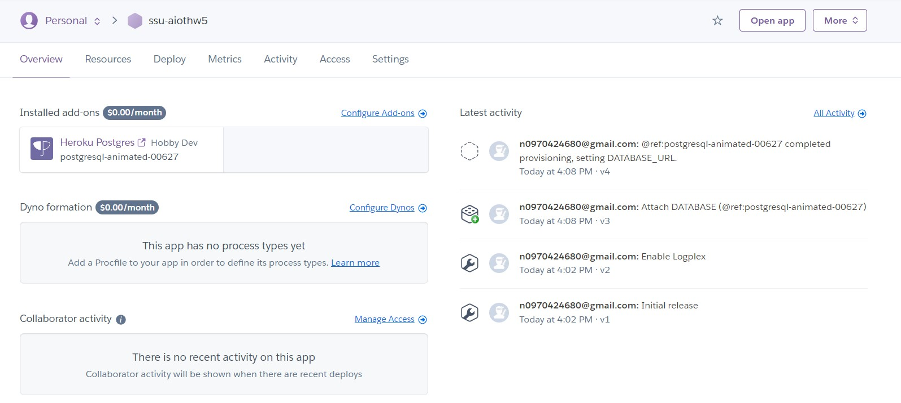
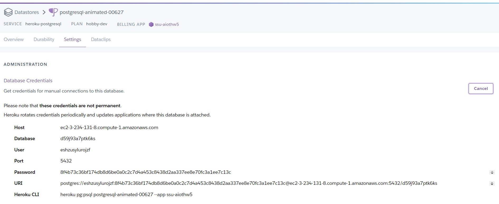
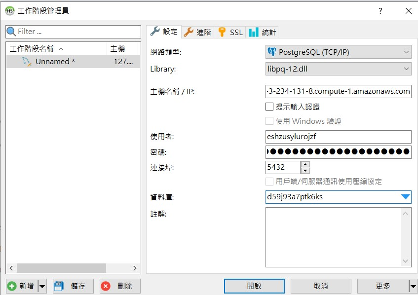
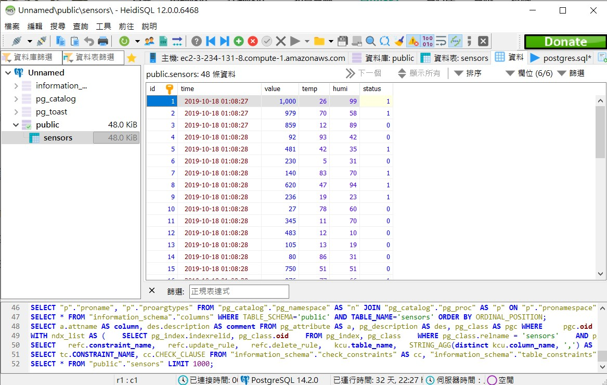
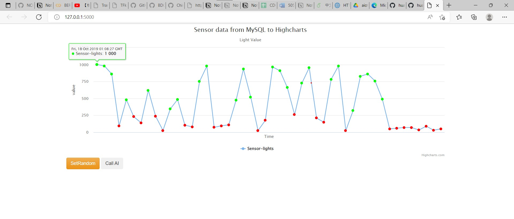
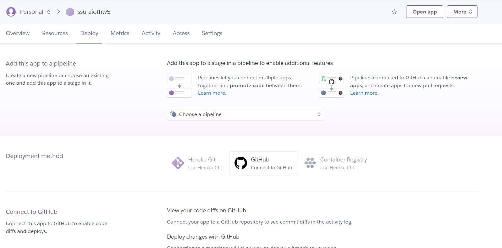

# AIOT_HW5
1. register github account 
2. create repository
3. clone in vs
4. push
5. 安裝python extension module
6. [](https://colab.research.google.com/github/googlecolab/colabtools/blob/master/notebooks/colab-github-demo.ipynb)

# Start Heroku
### 0. 安裝需要套件
```
pip install -r requirements.txt
```
### 1. 新稱app, heroku postgres

### 2. 在postgres的setting中找database的詳細資料

### 3. 在HeidiSQL連線到postgres db

### 4. 匯入db/postgres.sql

### 5. 將資料庫資訊加到app.py
```sql
myserver ="<fill-in-Heroku-Postgredb-DB-sever>"
myuser="<fill-in-Heroku-Postgredb-DB-user>"
mypassword="<fill-in-Heroku-Postgredb-DB-pwd>"
mydb="<fill-in-Heroku-Postgredb-DB-db>"
```
### 6. 嘗試在local端run

### 7. push到Git，接著把Heroku連結到Github
Heroku -> Deploy

自動部屬

### 8. 完成
https://ssu-aiothw5.herokuapp.com/
